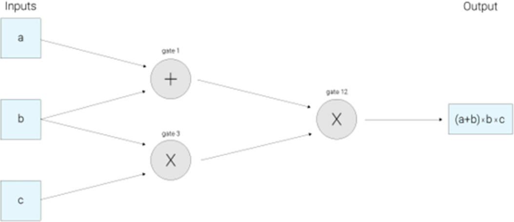

## Identification management and confidentiality
---
On the Bitcoin and Ethereum blockchain (before 2017), the identification of a user can be discovered. It therefore does not ensure the confidentiality required for a ** secret ballot vote**..

Indeed, the nature of the public block chain means that each transaction that takes place will be published and linked to a publication of a public cryptographic key. This key is encrypted so that a person looking at the history of the block chain would not be able to identify the actual identification of the individual behind this key. 

This anonymity could be preserved if this public key were used only once. But if this key is used several times, it is possible to determine that the same individual is hiding behind this public key.

> Diagram showing the possibility of linking a user to multiple transactions on the Bitcoin blockchain

Of course, the purpose of the public key is to distinguish one user from another on the network to ensure that the transaction is assigned to the right author.

One solution to this problem is to use the Zero knowledge proof (ZKP) method of proof.

The most widespread form at present is zk-SNARKs (zero-knowledge Succinct Non-Interactive ARgument of Knowledge), native to Ethereum since the Metropolis (Byzantium Fork) update on 12 October 2017 and native to Zcash. Another form of ZKP is also found on the Monera blockchain, which implements a circle signing system: Monero Ring Confidential Transactions (RingCT).

In order to have "unconscious privacy" in Zcash, the function determining the validity of a transaction according to the network's consensus rules must return the answer on whether or not the transaction is valid, without revealing any information about the calculations performed on it. This is done by coding some of the network's consensus rules in zk-SNARKs. 

At a high level, zk-SNARKs work by first transforming what you want to prove into an equivalent form on the knowledge of a solution to certain algebraic equations. 

> Demonstration of the arithmetic circuit for calculating (a+b)*(b*c) using zk-SNARKS

> Source: Zcash about zk-SNARKS

Looking at such a circuit, one can consider the input values a, b, c as "moving" from left to right on the wires to the output wire. The next step is to build what is called a Rank 1 Constraint System (R1CS) to verify that the values move "correctly". In this example, R1CS will confirm, for example, that the value that comes out of the multiplication gate where b and c are entered is b*c.

In this R1CS representation, the auditor must check many constraints - one for almost all the wires in the circuit.  This method uses a representation of the circuit called the Quadratic Arithmetic Program (QAP). The only constraint that needs to be checked is now between polynomials rather than between numbers. Polynomials can be quite large, but that's okay, because when an identity doesn't hold between polynomials, it won't hold on to most points. Therefore, it is sufficient to verify that the two polynomials correspond to a randomly selected point in order to correctly verify the proof with a high probability.

In concrete terms, this means that it is possible to obtain a transaction without sharing information.

To better understand how zk-SNARKS works in practice, let's look at an example of "how Alice can transfer money from one of her bank accounts to another, without providing Bob at Acme Bank with information to guarantee her identity".

For this scenario, we will need four entities:
* Alice - an individual who wishes to prove his identity without transmitting it
* Acme Bank - Trusted third party for bank account attestations, and a trusted third party for the installation of zk-SNARK.
* Bob - Acme Bank Call Centre Representative
* Self-Sovereign Identity Solution - Provider of digital identity data to Acme Bank App, and a trusted third party for the installation of zk-SNARK.

To perform this authentication operation, it is necessary to use a third party "ACME BANK": this third party will authenticate Alice using a third party application and return the true value if Alice is the person she claims to be.



The advantage of this system is that neither the Bank nor Bob has Alice's identifying information, nor does the third party have any idea of the nature of the transaction between the Bank and Alice. There is therefore a perfect separation between the operations performed and authentication.          

