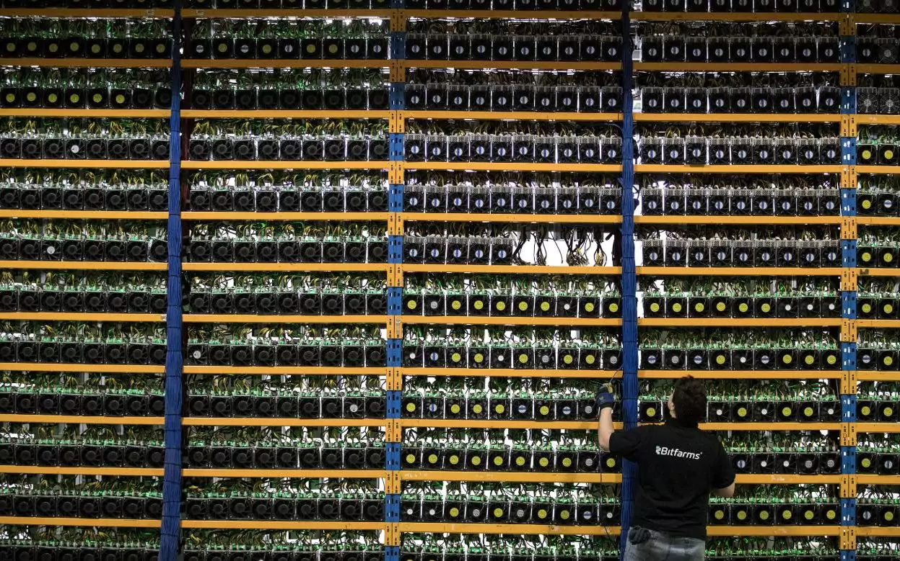

## Proof of work vs. proof of stake
---

We have seen earlier that a blockchain is a distributed registry that is encrypted and replicated in all nodes of the network, which contains the order chains that allow, through consensus building, to manage trust without an external institution.

### Concerning proof of work:

Proof-of-work English. Short for PoW.

We have seen earlier that the string consists of a set of data blocks containing information and a time stamp. With each transaction, these blocks are integrated into the chain.
 
In order to guarantee its integrity, this chain is encrypted and must be certified. 

To certify the transaction, powerful computers made up of networked nodes perform cryptographic calculations.

The overall certification work is called "proof of work". 

The machines (or institutions) that do this work of certifying English "minors" are called _*mining*_.

The cryptographic object created by the minor is proof of the time spent at certification, it constitutes proof of work. 

It is essential to ensure the real nature of the work of stakeholders in order to preserve consensus.

The result of an invention by Adam Back, inventor of the Hashcash protocol, it avoids easy cloning, which would have the consequence of being able to control the blockchain retroactively.

The mechanism is even more sophisticated: at regular time intervals, the difficulty increases.

> Graph illustrating the relative measure of difficulty in finding a new block. The difficulty is periodically adjusted according to the hash power deployed by the miner network.
>
>Source: blockchain.com 

Competition is the method used to motivate for certification, so the first minor to validate a new block will be rewarded.

For bitcoin, the certification task was originally accessible to private individuals through the use of graphic cards, whose power for the type of calculation required for certification was higher.

Since then, specific miners have appeared to carry out the proof of work and the general public graphic cards are neglected because they are not competitive.

Because as the size of the chains increases, so must the computing power. This interdependent relationship has driven individuals out of the certification race and institutions have now taken over.

> The bitfarm computation farm
>
> Source: bitfarms.io

In August 2018, there were 9,503 Bitcoin blockchain processing nodes worldwide.

> Global bitcoin nodes distribution
>
> Source: bitnodes.earn.com

Mining services are available in the cloud through cloud-mining, which nevertheless remains a model more oriented towards companies or large organizations than towards individuals.

### Regarding the proof of stake:

#### Selon Usman W. Chohan, Proof-of-Stake Algorithmic Methods: A Comparative Summary

The proof of the issue is a different algorithm than the proof of work to obtain a distributed consensus.

In crypto-currencies based on evidence of stakes, the creator of the next block is chosen by various criteria (e. g. random selection combinations, wealth or age). These criteria depend on the economic stake of a validator in the network. 

As a proof of work (PoW), the algorithm rewards participants who solve cryptographic puzzles to validate transactions and create new blocks (i. e. mining).

In public block chains based on evidence of issues (e.g., the upcoming implementation of Ethereum's Casper), a set of validators take turns proposing and voting on the next block, and each validator's voting weight depends on the size of its repository (i.e., its stake). 

Significant benefits of the proof-of-investigation method include safety, reduction of centralization risks and energy efficiency.

There are two types of algorithms for proof by stake: 

* Chain proof of the issue: 

    In chain-based proof, the algorithm chooses a validator at random for each time slot (e. g. every ten seconds), and assigns this validator the right to create a single block, and this block must point to a previous block (normally the block at the end of the longest chain). Thus, over time, we observe a growth in a single chain.
    
* Proof of the Byzantine-Fault-Tolerant (BFT) type of issue: 
    In the BFT proof of bet, the assignment is made at random and the validator is given the right to propose blocks. The agreement on the canonical blocks is made through a multi-round consensus where each validator votes for a specific block. At the end of this process, an agreement is reached between all validators on whether a block belongs to the chain or not.

### Advantages of proof of stake over proof of work: 

Proof of stake provides an undeniable advantage over proof of work: the amount of electricity required to secure a block chain is reduced.

The cost of the Bitcoin and Ethereum mechanism is estimated at more than $1 million in electricity and computer equipment per day. The subject is therefore crucial for the future development of the blockchain.

(Voir [Quid de ses impacts énergétiques](./impact_energetique.md))

Lower raw material consumption implies a lower need for motivation, and therefore a lower cost per transaction and better participation of the network.

This opens the door to a better regulation of the abuses that can affect the blockchain, such as the phenomenon of the selfish miner or the activities of cartels trying to centralize the blockchain.

The proof of the stakes introduces a reduction in the risks of centralisation. Random selection of a validator limits the interest in developing large infrastructures and allows small actors to survive. 

An additional benefit of using a proof-of-concept validation is the increase in the cost of a "51% attack" dramatically compared to the proof-of-work method. Thus the safety of the blockchain is reinforced.
   
> «taking part in a 51% attack is like burning your ASICS mining farm».
>
> Vlad Zamfir, Ethereum Foundation researcher 

### Comparative computer graphics of the two methods: 

The proof-of-investigation method offers undeniable advantages over methods currently in use, better safety, lower consumption and greater decentralization. Unfortunately, alternative validation methods are still in the development stage. The various problems of size and frequency of adding blocks, the purpose of mining and the concentration of mining capacity are challenges that developers will have to solve if these methods are to be considered as viable alternatives. 
