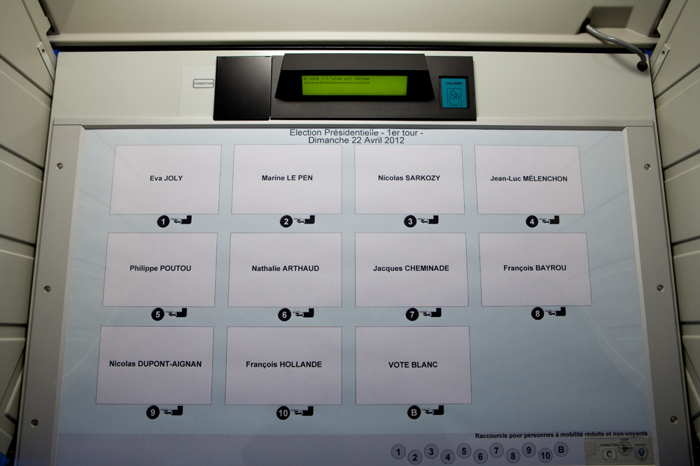

# Definition: vote
---

Voting (from the Latin _*votum*_ meaning "vow") refers to a method that allows a group to make a common decision. 

Formal or informal organizations of all kinds (economic, political, associative, etc.) use this practice. The practice of voting aims to give legitimacy to the decision by showing that it does not come from an isolated individual. Before the vote itself takes place, it is common for a period of discussion or debate to be set aside to allow each voter to present or read the arguments, in order to provide the best possible justification for their decision.

Voting is generally governed by an electoral process also known as "voting" or "election".

---

## The implications of the vote: 

| Principle | Explanation |
|------------------------|----------------------------------------------------------------------------------------------------------------------------------------------------------------------------------------------------------------------------------------------------------------------------------------------------------------------------------------------------------------|
| Decidability | The primary purpose is generally to be able to decide on a position, whether it is a position to take a decision, or a position not to take a decision; this is particularly the case for a referendum. |
| Voting uniqueness | Generally speaking, we want the vote to be unique: to allow everyone to be fairly represented, we must not allow an elector to vote several times, i.e. to be over-represented. |
| Representativeness | The vote must be representative of the opinion of the whole. In some systems, the votes of each voter are weighted by a share of participation. |
| Secrecy and transparency | Depending on the election, one may wish the vote to be secret, in order to prevent corruption of the vote, or on the contrary, public, in order to force an assumed position. |
| Verifiability | In order to remove any doubt about the legitimacy of the election, when an issue exists, we want the election to be verifiable, in other words, awe want everyone to see that there is no cheating. The aim is to ensure that the people and materials involved in the organisation are not diverted to the benefit of specific interests. |
| Attractiveness | Some commercial organizations promote votes with the unspoken aim of encouraging participation in an action that without saying it is an act of purchase. This is particularly the case for votes to purchase by "value-added service numbers" also known as premium rate telephone calls. |
| Non-participation | To avoid that a decision is taken by default or to compensate for certain contingencies, it is customary to allow non-participation, for example through abstention or a nil or blank vote. |
| Quorum and majority | To give greater legitimacy to decision-making, the voting method may be correlated with a quorum system, i.e. a minimum number of members present at a meeting without which a deliberation within the meeting cannot be valid |
| Rapidity | In a vote where a positive result is expected, it is customary to ask first who is against and then who abstains. Those who do not speak out are then assumed to be in favour of the decision. This has a double advantage: it avoids having to count the many pros, while maximizing their number. |

---

## Expression modalities: 

* Secret ballot: A secret ballot, also known as a secret ballot, consists of giving an opinion on several proposals, anonymously. 

* Show of hands: 
A show of hands vote consists of raising your hand to give your opinion between several proposals. It allows a quick decision making, because the counting is almost immediate. But this requires that all voters be present at the same time. The procedure can begin with an acclamation vote, where the volume of each option is estimated, as in the Spartan assembly or at the conclusion of presidential primaries in the United States.
Voting by show of hands does not guarantee the confidentiality of the vote, this voting system guarantees a form of transparency in representative democracies. 

>
> Hands up voting, source French National Assembly

* Public vote:
A public vote, also known as a roll-call vote, consists of calling each member of a meeting in turn to cast his or her vote publicly. This is then recorded in the register of deliberations and it is then possible to publish the vote of each of the participants in the vote.

* Postal voting:
it consists in sending the ballot paper in advance by post; an identification number ensures that a person only votes once, while maintaining the secrecy of the vote.

* Voting by proxy: Proxy voting allows the principal to appoint a proxy to vote in his or her place. 

* Replacement vote:
Substitute voting allows those who vote for candidates or lists that do not have elected representatives because they have not reached a quorum to allow their votes to be carried over to another candidate.

* Electronic voting:
Electronic voting is an automated voting system, including 
elections, using computer systems. This generic term actually refers to several concrete situations. For example, it may correspond to the computerization of the voting process allowing remote voting, i.e. voting from home, or from anywhere in the world and thus avoiding travelling to polling stations.

    
    >
    > A French electronic voting machine, source Saint-Pol-sur-Mer Town Hall.

* Vote by key: 
It consists of voting using a physical key on a dedicated desk.

---

## The particular case of Internet voting is not a specific one.

Internet voting, which is part of the mode of action of electronic voting, has long been criticized on the grounds that its main disadvantage would be the absence of a voting booth (there is no guarantee that citizens are alone in front of the computer when they vote, nor can they verify it). However, this insurance is also absent during public voting, by post, by show of hands. It is also impossible to ensure that the principal's wishes have been respected in a proxy vote.
