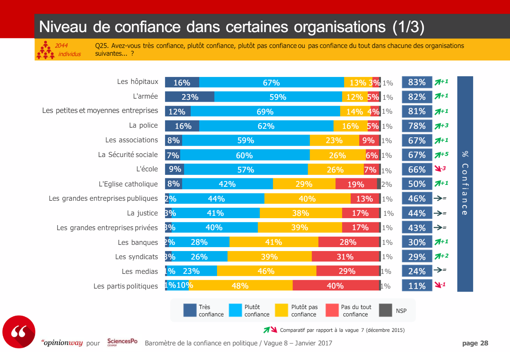

# The origins of the crisis of trust and the desire for transparency

## The era of post-truth

"Post-truth": this is the neologism that the Oxford University dictionary has chosen to call the international word of the year 2016. It comes from the book _*The Post-Truth Era by Ralph Keyes*_.

> This notion is generally associated with the fanciful and misleading statements of Donald Trump and those who voted for him from the working classes of American society. But, in reality, the responsibility for the post-truth era lies with the middle-class professionals who paved the way for its recent triumph. Academics, journalists, "creative" and traders: all have contributed to the advent of the 
"post-truth"; even centre-left politicians, who are hard hit by the success of the anti-factual movement.
>
*Andrew Calcutt, The Conversation*

As early as 1964, in Truth and Politics, Hannah Arendt asked herself the question of the objectivity of history. From the first sentence, by evolving opinion and interpretation, it engages reflection on the field of the historian's supposed subjectivity. 

This legitimate questioning and questioning has opened the door to a deeper questioning. There would be an entire part of reality that could only be apprehended through the subjective gaze of the observer.

In the second half of the 1990s, the creative industries succeeded in generating spectacular growth through the development of branding. Branding has become much more important than the ordinary activity of designing, developing and manufacturing a product. 

Instead of marketing a product as useful, these creative people have undertaken to give it a soul, a conscience and a moral.

At the turn of the century, the government was already less concerned with "the truth" than with how "the truths" could be (un)turned. Those called "spin doctors" have taken centre stage. The war in Iraq is an excellent example of this. 

The facts have been relegated to the background. 

In this perspective, all claims to truth are related to the person who makes them; apart from our own particularities, no position can be established 
the universal truth. It is one of the fundamental principles of postmodernism, a concept that took off in the 1980s after the publication of La Condition postmoderne: rapport sur le savoir by Jean-François Lyotard. 

Postmodernism did not create the foundations of the "post-truth" era. 

These foundations have been built by the dishonest misuse of a number of concepts evoked by post-modernism combined with revelations of political, economic and ecological scandals over the past fifty years.

Originally sometimes suspicious or suspicious, the general public has become hyper-critical about the facts.

The Internet has amplified this reaction by keeping this audience in confirmation spheres on social networks or through the media they consult.

Today it appears as a challenge for entities addressing these citizens to understand these ideological circles and their influence on the message they convey. 

>
> Source Study Cevipof Sciences Po

As we can see from the computer graphics above, large private companies, banks, trade unions, the media and political parties are among the least trusted by the general public.
 
In this paper, we will deal mainly with public institutions, private companies and associations.

It would be futile to try to list all the manifestations of this crisis of confidence or even its origins, which are controversial. Nevertheless, it should be noted that it undoubtedly exists, as evidenced by the many press articles on this subject, and that its existence requires a profound rethinking of the relationship with the world of companies, associations and States by integrating its new requirements of transparency.
