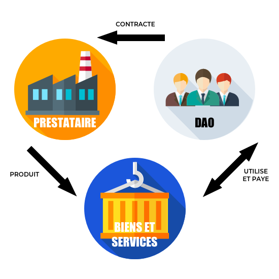

## Corporate governance
---

The blockchain proposes a corporate governance model with evidence, traceability and transparency. Some organizations already rely on this technology, such as DAOs.

#### DAO
A DAO (Decentralized Autonomous Organization) is a decentralized organization that relies on the blockchain to operate. Members acquire tokens to participate in votes on various decisions that will be embodied in the form of smart-contracts. 
 The rules governing it are written in advance in this same blockchain.

This is in line with the principle of law by code (law by code). 

The advantage of this method is to have an immutable proof.

> It is an incorruptible form of organization that belongs to the people who helped create and finance it, and whose rules are public. There is therefore no need to trust anyone, because everything is in the code, auditable by everyone.
>
> Stephan Tual, TheDAO

DAOs use smart-contract technology (see smart-contract) to operate.

###### What are the elements brought by a DAO?

According to Simon de la Rouviere, blockchain Consensys: there are three fundamental elements brought by a DAO. 
The first is that the DAO is unstoppable, it can neither be closed nor stopped. 
The second is that the entity is forced to act transparently and the integrity of its data is preserved, so an individual cannot claim to manipulate or control it.
Last but not least, is the auditability at the supranational level. Indeed, when auditing an entity, the auditors rely either on control bodies in the country of residence or on independent auditors. Sometimes it is impossible to carry out these controls freely or without fear of fraud. 

The DAO appears to be an open, global organization, independent of any jurisdiction and protected from some of the frauds that affect traditional organizations through the application of the Act by the Code.

###### TheDAO

TheDAO project is the initiative of the start-up slock.it and is the most remarkable example of this type of organization. It is above all a concrete experimental realization, illustrating the feasibility of such a system (POC). 

The type of DAO organization is not adapted to all situations, but it does respond to a situation where trust is not necessary because the organization's functioning is guaranteed. TheDAO relies on the Ethereum blockchain to operate.
 
The three possible actions within TheDAO were first the project evaluations, secondly the collective decision and thirdly the distribution of risks and related rewards.

This project was located on the border between crowdfunding, the foundation and the investment fund.

> A diagram illustrating a CAD

####### TheDao and the vote

In order to participate in the vote on the TheDAO platform, tokens had to be purchased and exchanged for a vote.

It is therefore a conventional transaction.

The voter will then be paid if his proposal is funded. 

####### End of the project

In June 2016, TheDAO's development was halted following a major attack. This was therefore only a short experiment that highlighted the areas for improvement for the development of this type of organization.

It is easy to imagine that having a blockchain to register your company's shares will become as essential as an accountant for the financial markets.



In order to put this failure into perspective and illustrate the public's enthusiasm for blockchain technology, it is worth recalling that at its crowdsale, the public auction of tokens, TheDAO was the biggest crowdfunding campaign of all time, raising more than $160 million in just one month.



#### Corporate co-governance: a prospective approach

The blockchain is an opportunity for companies in several ways. It offers both the transparency perspective that the general public demands, but also solves consumer involvement in the governance of products and services.

This participation can be considered at two levels: at the level of product or service governance or at the level of the company.

The co-governance or co-design of a product or service for a company would make it possible to maximize customer involvement, and therefore to design a tool adapted to the majority of them. This co-management does not imply leaving all decisions to the crowd, quite the contrary. Thanks to the blockchain, it is possible to rethink the client's place and to set the participation in a transparent way, with well-defined rules in advance.

Co-management of the company makes it possible to involve the consumer at a higher level, by participating in the company's strategic decisions. Such participation does not force the company to give the general public full orders, it will be up to each entity to define the desired area of influence, this definition can even be given to the vote.

Thus, the involvement of the general public is maximum and could generate greater support.



The potential form of this tool could be halfway between current crowdfunding platforms and a DAO. Innovation with respect to current platforms would be the transparency of processes and the fine control of the consequences of collaborative decision-making.


