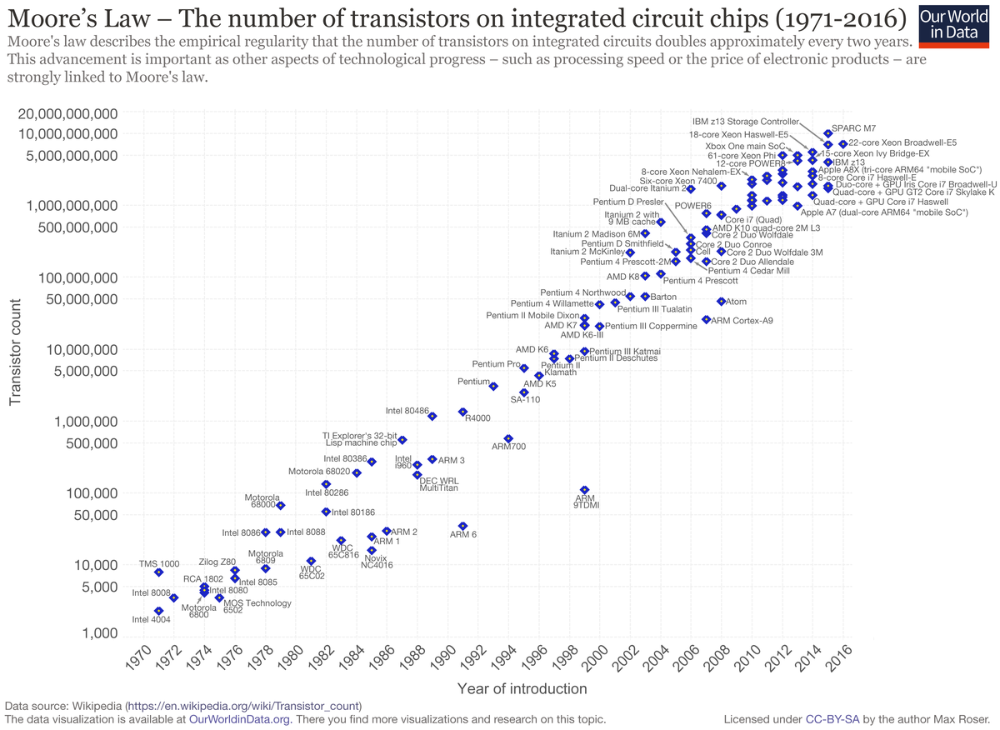

## Vers une normalisation ?
---

> 10% du PIB mondial en 2025 proviendra d’activités utilisant la blockchain.
> 
> Ravi Jhawar, le responsable du projet au sein du GIE de l’Anec

### Une régulation par la normalisation
Le Luxembourg, par le biais de l’Ilnas, participe à la création d’une norme technique internationale pour encadrer la blockchain. 

Dans un [livre blanc](../../sources/wp_blockchain_ilnase.pdf), l'organisation espère initier une démarche et s'imposer comme un acteur de la régulation à travers une norme ISO.

L'objectif est d'encadrer la gouvernance des blockchains afin de peser dans les enjeux économiques et écologiques qui la concernent. 

Cette normalisation se confronte à la volonté d'indépendance et de décentralisation, base fondatrice des technologies blockchains. 

Néanmoins la mise en place d'une norme peut impliquer une meilleure régulation énergétique en imposant par exemple l'origine renouvelable de l'électricité nécessaire au fonctionnement de la technologie.

### La standardisation pour lutter contre la consommation et l'obsolescence des moyens de productions.

Le terrain de réduction de la consommation énergétique de la blockchain se dessine lorsque l'on évoque la standardisation ou la normalisation.

Il s'agit de la standardisation des algorithmes et celui du matériel polyvalent.

Ces deux directions d'optimisation ne sont en fait qu'une seule et même voie: un standard algorithmique signifie un matériel dédié adapté, et donc une optimisation plus importante car les investissements de Recherche & Développement seraient focalisés sur un seul type de matériel.

Les blockchains fonctionnant sur la méthode de preuve de travail ont en commun l'utilisation d'un algorithme de hachage. Celui de Bitcoin est nommé Hashcash.

En recherchant un algorithme plus économe pour remplir cette fonction, la blockchain pourrait voir son coût écologique se réduire et se présenter comme une alternative viable à grande échelle.

Afin de miner, les individus ou institutions mettent à disposition du matériel afin de réaliser des calculs. 

Sur certaines blockchains, comme bitcoin, il est inutile et non-rentable de s'essayer à la chose avec du matériel classique.

Ce mode de calcul est réservé à des Blockchains plus récentes ou bénéficiant de moins d'engouement.

Les mineurs professionnels ont recours à du matériel performant, qui exclut les mineurs amateurs de la course à la rémunération, dans le cadre de la preuve de travail seulement. Ceux-ci étant bien trop lents pour valider les transactions face à ces sprinteurs.

Le minage est divisé entre deux technologies, les puces dédiées: **FPGA / ASICS** et les puces généralistes **CPU / GPU**.

Explication des acronymes: 

| Acronyme | Explication |
|----------|--------------------------------------------------------------------------------------------|
| CPU | *Central processing unit* ( Unité centrale de traitement ) |
| GPU | *Graphics Processing Unit* ( Processeur graphique ) |
| ASICS | *Application Specific Integrated Circuit* ( Circuit intégré spécifique à l'application ) |
| FPGA | *Field-Programmable Gate Array* ( Réseau de portes programmables in situ ) |

Les premières ne sont utilisées que dans le calcul cryptographique dans le cadre de la Blockchain, les secondes trouvent une utilisaiton dans les opérations courantes.

Les mineurs ASICS ET FPGA sont majoritairement utilisées dans le calcul SHA256 (Bitcoin), tandis que les CPU / GPU sont plutôt utilisés sur des cryptomonnaies plus récentes.

Afin de maintenir la complexité de calcul au sein d'une blockchain, la difficulté doit augmenter au fil des avancées technologiques. 

Lorsqu'on observe les capacités des puces de calculs, on constate une augmentation significative de leur puissance. Ainsi réaliser un calcul cryptographique considéré comme complexe dans les années 80 prend quelques secondes avec un téléphone protable actuel.

Ce schéma présente l'augmentation de la puissance de calcul des puces CPU.

>
> Evolution de la puissance de calcul des ordinateurs et de la complexité du matériel informatique selon les conjectures de Moore  

Lorsque l'on compare l'augmentation de la puissance de calcul des GPUs par rapport aux CPUs, on imagine aisément le bond de complexité que les algorithmes ont subis.

>
> Comparaison entre le nombre d'opérations en virgule flottante par seconde ( FLOPS ) des CPUs ( architecture X86 ) et les GPUs NVIDIA

Sur cette dernière illustration, nous pouvons constater que la puissance de calcul des GPUs sur certaines opérations est spéctaculairement plus importante que les CPUs, or, dans le cadre de la Blockchain, les mineurs ASICS ET FPGA sont bien plus performants que les GPUs. 

D'autres contraintes reposent également sur le choix du matériel, C'est ainsi que certains algorithmes nécessitant une importante utilisation de la mémoire rendaient les mineurs ASICS peu compétitif car les composants mémoires sont particulièrement couteux.

Mais 2017 a marqué un tournant dans l'utilisation de ces cartes avec une amélioration substantielle de ces modules mémoires. La solution pour maintenir la complexité fut de modifier les algorithmes, rendant le matériel obsolète car les fonctions d'un mineur ASICS sont gravées à même le silicium. On parle alors de fonctions câblées.

Ces fonctions câblées se retrouvent dans d'autres architectures de puces, comme les GPUs.

**Un coût économique et écologique important pour garantir la sécurité et la scalabilité de ces blockchains.**

Pour comprendre pourquoi les puces sont rendues obsolètes il faut intégrer  que la différence entre un CPU et un ASIC (ou entre un CPU et un GPU) réside dans le fait que le CPU est une puce programmable, et doté d'une grande polyvalence dans son utilisation au prix néanmoins d'une performance moindre.
 
 UN GPU ou un ASIC est une puce spécialisée, dont les performances sont excellentes dans l'accomplissement des taches pour lesquels elle est programmée, mais qui sont plus réduites en nombre que pour un CPU. 
 
 Par exemple, pour un GPU, spécialisé dans la représentation graphique, l'affichage d’un maillage 3D texturé à 60-100 frames par seconde.
 
 Cette performance permet d'obtenir des meilleures performances en termes de calcul brut sur ces tâches précises, mais également une consommation électrique plus faible.
 
 Cette amélioration de performance est rendue possible par le fait de graver directement dans le silicium de la puce les fonctions , nécessaires à la translation, rotation etc. On appelle cela «câbler» les fonctions. 
 
 Pour un mineur ASIC, cette spécialisation se traduira dans une performance inégalable dans la résolution d'un algorithme de chiffrage par exemple. Mais il n’est pas possible d’utiliser un ASIC spécialisé dans le calcul de hashs SHA256 pour du KECCAK et inversement.
 
 
Dans ces tendances, une solution intermédiaire a vu le jour et exploite le meilleur des deux mondes: le FPGA.

#### Le FPGA.
Les FPGA (Field-Programmable Gate Array) sont des circuits intégrés en silicium reprogrammables. 

Reprogrammer un FPGA consiste à redéfinir le circuit intégré lui-même pour implémenter la fonctionnalité souhaitée, au lieu d'exécuter une application logicielle. 

On peut voir le FPGA comme une puce qui simule au plus bas niveau une puce spécialisée.  

Les FPGA sont particulièrement utilisés pour simuler un mineur ASIC dans la phase de préproduction afin de tester le modèle et ajuster les schémas logiques. Lorsque le fonctionnement est jugé suffisant, le schéma est alors figé pour produire un mineur ASIC. 

Les mineurs FPGA offrent des performances légèrement moindres que les mineurs ASICS. On note aussi que la logique de programmation d’un fpga nécessite des compétences poussées et peu répandues.

Malgré ces désavantages, des cartes FPGA aux capacités de calcul titanesque sont en train de se développer pour répondre aux besoins du machine-learning et du deep-learning. 

Ces cartes permettent d'envisager une continuité d'utilisation future malgré les bifurcations ( forks ) et les évolutions des algorithmes, ce qui permet de limiter les coûts et de limiter l'impact écologique dû à l'obsolescence du matériel.

##### La normalisation par le câblage de fonctions
Pour comprendre comment des cartes dédiées à la blockchain pourraient voir le jour, il faut revenir en arrière dans l'histoire de l'informatique. A l'origine seuls les CPUs effectuait des calculs attenant à la 3D. Puis vinrent les GPU, dont les fonctions câblées permettaient des performances plus grandes. Il est tout à fait envisageable de câbler les fonctions nécessaires aux algorithmes implémentés dans la blockchain, à la manière des Physics Processing Unit qui implémentaient une carte supplémentaire pour la gestion de la physique et qui sont depuis intégrés aux cartes graphiques Nvidia.



À l'heure actuelle, les Blockchains sont optimisées en fonction du matériel disponible, elles s'adaptent à du matériel qui n'est que peu optimisé pour cet usage.
Cette optimisation pourrait s'effectuer à l'aide du câblage de fonctions, mais pour cela il faut que les constructeurs puissent anticiper l'avenir de la Blockchain pour prévoir les gains à long terme. 

Aujourd'hui, celles-ci évoluent vite et de nombreuses implémentations sont divergeantes, autant de contraintes qui repoussent l'étape d'optimisation matérielle.

Cette étape pourrait être facilitée par la normalisation des Blockchains. 


