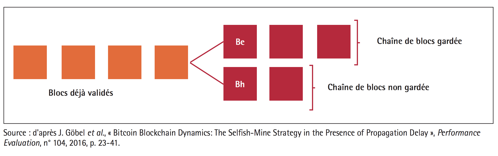

## Quid de la sécurité de la blockchain ?
---

### Les garanties de la Blockchain en matière de sécurité :

Il n'existe pas de technologies sûre, la sécurité et la sureté sont un idéal, pas un absolu. On peut considérer que la Blockchain, répond à ces impétraotfs dans la mesure ou elle assure les points suivants:

 * La disponibilité : Les données étant distribuée et décentralisée , elles sont disponibles tant qu'un noeud est en mesure de transmettre le registre. 
 
 * L'intégrité : le mécanisme de consensus sont conçu pour permettre aux informations d'ètre intégrées et conservées sans que celle ci ne soit altérées. Le pré-requis à cette disposition est qu'un nombre suffisant de noeud soient en connecté au réseau et que les conditions permettant une attaque des 51% ne soient pas atteintes.
 
 * La confidentialité : La confidentialité est un point complexe concernant la blockchain puisque les données sont disponibles publiquement pour garantir la transparence.
 
  Néanmoins cette confidentialité peut ètre rendue possible par l'implémentation d'un système de preuve à divulgation nulle de connaissance. Les protocoles sans connaissances permettent le transfert de ressources à travers un réseau distribué, peer-to-peer blockchain, en toute confidentialité. Dans les transactions régulières en chaîne de blocs, lorsqu'un actif est envoyé d'une partie à l'autre, les détails de cette transaction sont visibles pour toutes les autres parties du réseau. En revanche, dans une transaction sans connaissance, les autres ne savent qu'une transaction valable a eu lieu, mais rien sur l'émetteur, le destinataire, la catégorie d'immobilisations et la quantité. [Voir Gestion de l'identitée et confidentialitée](./identity_and_confidentiality.md)
 
 * La traçabilité : Parce qu'elle est basée sur un empilement de blocs cryptographique, la Blockchain permet d'enregistrer l'intégralité des transactions et de remonter au bloc zéro, assurant la meilleure des traçabilité.
 
 * L'authentification: Pour s'assurer de la bonne identité d'une transaction, l'émetteur signe celle-ci à l'aide de sa clé privée qui tant qu'elle n'est pas connue assure la véracité de la transaction. 
 
 * La non-répudiation et l'imputation : par le biais de la validation basée sur le consensus, la Blockchain permet la non-répudiation des données nativement, quant à l'imputation, chaque mineur certifiant une transction est authentifié sur le réseau, il est donc possible d'identifier un mineur fautif et de le disqualifier.

---
### Les menaces qui pèsent sur la Blockchain en matière de sécurité:

Selon Patricia Egger et Dusko Karaklajic dans La sécurité du blockchain, des menaces pèsent sur l'écosystème naissant en raison de l'immaturité et la complexité de la technologie.

En effet, les nombreux algorithmes de consensus disponibles, les types de Blockchain, et protocoles cryptographiques complexes sous-jacents rendent la technologie difficile à appréhender.

L'absence de normes et de réglementations sur la technologie du Blockchain constitue également un risque, ce qui entraîne des incertitudes juridiques et des zones grises. Ce terreau fertile au piratage et à la manipulation frauduleuse rendent la technologie encore peu crédible pour des usages sérieux. 

Le risque le plus importante demeure la croyance dans la sécurastion absolue autour de la Blockchain. Bien qu'elle repose sur des mecanismes cryptographie fiables et éprouvés. Cette sécurisation ensera jamais complète par nature : les protocoles cryptographiques ont leurs limites et la sécurité globale intègre également les élements périphériques, le risque humain est ainsi toujours présent. En ce dernier point, la Blockchain apporte une nouvelle manière de traiter certaines données mais n'affranchit pas des démarches clissiques en matière de sécurité des sytsèmes d'informations.

En outre la Blockchain est sensible à des attaques particulières, comme l'attaque de type Golfinger.

#### Attaque des 51% ou attaque Goldfinger

Une attaque des 51% cible les blockchains basée sur la preuve de travail et preuve de l'enjeu.  

Le but de cet attaque est d'empecher les validations des transactions et de parlayser le réseau. Mais également manipuler l'historique pour valider deux fois une transaction sans pour autant que la dépense ne soit effective. 

La validation des blockchains se fait grâce aux minages.

Afin de se garantir une rémuneration dans le cadre d'une blockchain fonctionnant sous la méthode de la preuve de travail, les mineurs se regrouopent en groupe (ou pools), de façon à disposer d'une puissance supérieure et de mutualiser les coûts. Ils partagent alors les efforts mais également les gains.

Mais le danger d'un groupe disposant d'une puissance trop importante est qu'il peut réaliser une attaque des 51%.

En effet l'un des principe fondateur de la blockchain est que le calcul est distribué entre tous les noeuds où le calcul est validé par la méthode de consensus. Ainsi si un seul individu introduit une erreur de calcul volontairement ou fallasieusement, les autres mineurs vont automatiquent disqualifier son travail et son bloc va demeurer orphelin et ne sera jamais intégré.



Lorsqu'un groupe de mineur dispose de plus d'au moins 51% des capacités de calcul, il devient possible, en théorie d'outrepasser le mécanisme de consensus et donc d'imposer des blocs fallacieux qui seront ajouté au registre officiel. 
Ainsi si un groupe devient trop puissant, il est en capacité de définir quels informations sont légitimes au sein d'une blockchain.



##### L'exemple de la 'double dépense'

En imaginant qu'un groupe dispose de plus de 51% de la puissance totale, il peut alors procéder à une manipulation frauduleuse du registre appellée le hack de la double dépense.
 
Ce hack consiste à effectuer des transactions entre deux comptes. IL effectue un débit du premier compte vers le second, et disposant de la puissance nécessaire pour manipuler la blockchain, efface la transaction. Pour ce faire Il suffit de ne pas inclure la transaction dans les blocs minés, et attendre qu'une blockchain plus longue que la blockchain courante vienne la remplacer.

Une fois la transaction effacée dans le registre du registre distribué, le second compte apparait comme n'ayant jamais été débité tant que le second a bien reçu la somme.
 Il s'agit d'une création de monnaire ex-nihilo des unités de crypto-monnaie.
 
Une telle oprération entrenera rapidement la chute du cours de la cryptomonnaie. Le groupe menant des activités frauduleuse devra alors rapidement convertir ses actifs dans une monnaie courante comme l'euro ou le dollar, ce qui accélèrera la chute du cours.

L'opération est facilitée par le biais de moyens automatisée rendant l'action automatique.

Cette attaque est inenvisageable sur des blockchains bien installée comme le Bitcoin,  mais cela peux être une chaine de traçabilité alimentaire par exemple ou dans notre cas une blockchain de vote. 

une telle approche est inaccessible pour une entreprise privée, mais pas d'un état souverain ou d'un état voyou, qui dispose des budgets nécessaires et peut avoir comme motivation de perturber une blockchain concurrente ou occasionnant un trouble.
    
A l'inverse, sur des  blockchains ayant une faible capacité de minage (récente ou de petite taille), cette attaque est facilement envisageable. 

Dans ce dernier cas, une puissance de calcul faible, dont pourrait disposer une organisation lambda suffirait à réaliser l'attaque.



Les blockchains récemment créée sont donc dans une position d'extrème vulnérabilité.



##### Les objectifs d'une attaque des 51%

* Fraude des registres et dispartition des transactions :
   
   Dans le cadre d'une blockchain privée, par exemple implémentant le vote ou de traçabilité alimenataire, cela permettrait de falsifier les informations. 
   
   Dans le cas d'une cryptomonnaie, cela permet la double dépense, qui permet à la fois de s'enrichier et de déstabiliser le cours de la monnaie.

* Rompre le lien de confiance : 

    Les blockchains de par leur fonctionnement décentralisé posent des problématiques de gouvernance et sont perçues comme une menace par certains états ou institutions, perturber le fonctionnement de ces blockchains permet d'aliener le lien de confiance des utilisateurs envers la blockchain.

##### Résilience des blockchains à l'attaque

Le système des crypto-monnaies est conçu pour ètre résilient aux attaques des 51%, lorsqu'une telle attaque est constatée. Un patch peut ètre déployé et limite les dégats causés par l'attaque. 

###### Coûts estimés d'une attaque au 51%

Les coûts pour réaliser une attaque des 51% varie en fonction de l'échelle de la blockchain visée.
 
 Concernant le Bitcoin diverses estimations ont été réalisées par Jean-Paul Delahaye dans L’attaque Goldfinger d’une blockchain

A l'aide de ses calculs, on peut estimer le coût en mai 2017 à **878 millions de dollars**.

En comparaison le buget de l'Etat Français est de 400 milliards d'euros par an, celui d'une agence gouvernementale comme la NSA est de 45 milliards de dollars.

L'attaque est donc innaccessible à une institution lambda mais pas strictement inaccessible.

#### Stratégie du mineur égoïste
L'exemple du mineur égoïste est explicité dans Les risques des blockchains, par Laurent Dehouck, Maître de conférences en sciences de gestion, ENS Rennes et Audrey Thomas, ENSAM.

Lorsqu'une transaction a lieu, le mineur qui découvre la solution en premier premier dispose d’un bloc Be.
 
 Ce bloc est censé être comminuqé aux autres noeuds afin d'ètre intégré dans la Blockchain. 
 
 Mais ce mineur, malhonnête, peut garder ce bloc secret et travailler de suite à la validation du bloc suivant.

Dès l’instant q'un autre mineur, "honnête", valide un bloc Bh , il souhaite le diffuser aux autres noeuds. 

Le mineur, malhonnête, va alors diffuser son bloc Be. Le réseau se retrouve ainsi en présence de deux blocs validés presque en même temps et temporairement conservés sur la blockchain.

Certains noeuds du réseau auront connaissance du bloc Be et d’autres auront connaissances du bloc Bh. 

Des nouveaux blocs vont alors s’ajouter à la suite de Be et Bh. 

Pour le mineur malhonnête, l'avantage demeure dans le fait de ne pas divulguer le bloc Be lui donne un avantage stratégique vis-à-vis du reste des utilisateurs du réseau pour la recherche de la solution suivante, car chaque bloc validé est relié aux blocs précédents. 

La création simultanée de deux blocs provoque ce qu’on appelle une "bifurcation", dès lors la chaîne contenant sera conservée car la chaîne contenant le bloc Be sera plus longue.

 
 > Illustration d'une bifurcation



Ce genre de stratégie invite à repenser la question de la normalisation de la Blockchain.


