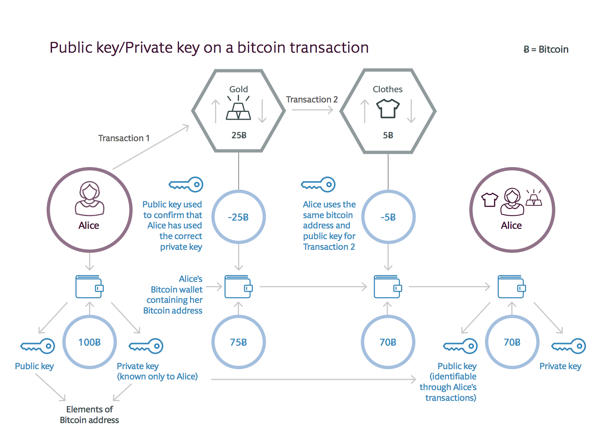
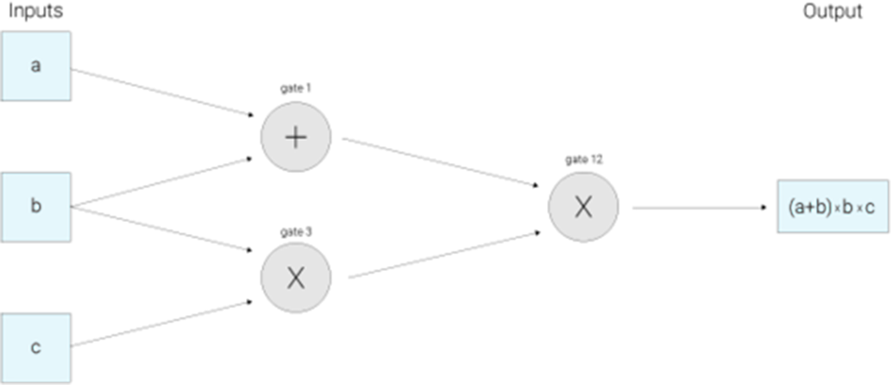
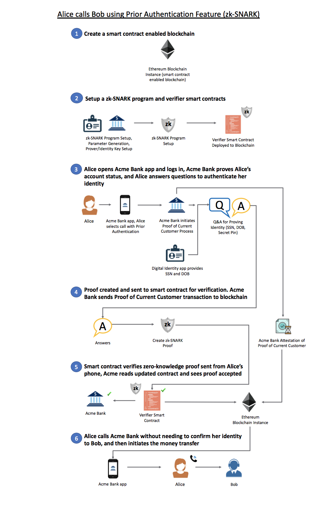

## Gestion de l'identification et confidentialité
---
Sur la Blockchain Bitcoin et Ethereum (avant 2017), l'identification d'un utilisateur peut ètre découverte. Elle n'assure donc pas l'impératif de confidentialité requise pour un **vote à bulletin secret**.

En effet, la nature de la chaîne de blocs publique signifie que chaque transaction qui a lieu sera publiée et liée à une publication d'une clé cryptographique publique. Cette clé est chiffrée pour qu'une personne qui regarderait l'historique de la chaîne de blocs ne soit en mesure d'identifier l'identification réelle de l'individu derrière cette clé. 

Cet anonymat pourrait être préservé si cette clé publique était utilisée une seule fois. Mais si cette clé est utlisée plusieurs fois, il est possible de déterminer qu'un même individu se cache derrière cette clé publique.

> Schéma démontrant la possibilité de relier un utilisateur à de multiples transactions sur la Blockchain Bitcoin

Bien entendu, l'objectif de la clé publique est de distinguer un utilisateur d'un autre sur le réseau pour s'assurer que la transaction est attribuée au bon auteur.

Une solution à ce problème est d'utiliser la méthode de preuve à divulgation nulle de connaissance (Zero knowledge proof ou ZKP).

La forme la plus répandue à l'heure actuelle est zk-SNARKs (zero-knowledge Succinct Non-Interactive ARgument of Knowledge), présente nativement sur Ethereum depuis la mise à jour Metropolis (Byzantium Fork) le 12 octobre 2017 et présente depuis l'origine sur Zcash. On trouve également une autre forme de ZKP sur la Blockchain Monera, qui implémente un système de signature de cercle: Monero Ring Confidential Transactions (RingCT).

Afin d'avoir une «vie privée sans connaissance» dans Zcash, la fonction déterminant la validité d'une transaction selon les règles consensuelles du réseau doit retourner la réponse sur la validité ou non de la transaction, sans révéler aucune information des calculs effectués sur cette dernière. Cela se fait en codant certaines des règles de consensus du réseau dans zk-SNARKs. 

À un niveau élevé, les zk-SNARKs fonctionnent en transformant d'abord ce que vous voulez prouver en une forme équivalente sur la connaissance d'une solution à certaines équations algébriques. 

> Démonstration du circuit arithmétique pour calculer (a+b)*(b*c) à l'aide de zk-SNARKS

> Source: Zcash à propos de zk-SNARKS

En regardant un tel circuit, on peut considérer les valeurs d'entrée a, b, c comme «se déplaçant» de gauche à droite sur les fils vers le fil de sortie. L'étape suivante consiste à construire ce qu'on appelle un système de contraintes de rang 1, ou R1CS (Rank 1 Constraint System), pour vérifier que les valeurs se déplacent «correctement». Dans cet exemple, le R1CS confirmera, par exemple, que la valeur qui sort de la porte de multiplication où b et c sont entrés est b*c.

Dans cette représentation R1CS, le vérificateur doit vérifier de nombreuses contraintes - une pour presque tous les fils du circuit.  Cette méthode utilise une représentation du circuit appelée Programme arithmétique quadratique (QAP). La seule contrainte qui doit être vérifiée est maintenant entre les polynômes plutôt qu'entre les nombres. Les polynômes peuvent être assez grands, mais ce n'est pas grave, car lorsqu'une identité ne tient pas entre les polynômes, elle ne tiendra pas à la plupart des points. Par conséquent, il suffit de vérifier que les deux polynômes correspondent à un point choisi au hasard afin de vérifier correctement la preuve avec une probabilité élevée.

Concrètement, cela signifie qu'il est possible d'obtenir une transaction sans partager d'informations.

Pour mieux comprendre le fonctionnement en pratique de zk-SNARKS, observons un exemple de «comment Alice peut transférer de l'argent d'un de ses comptes bancaires à un autre, sans fournir à Bob de la banque Acme des informations pour garantir son identité».

Nous devrons pour ce scénario disposer de quatre entités:
* Alice — un individu qui désire prouver son identité sans la transmettre
* Acme Bank — Tiers de confiance pour les attestations de compte bancaire, et un tiers de confiance pour l'installation de zk-SNARK.
* Bob — Représentant du centre d'appels d'Acme Bank
* Solution d'identité autosouveraine - Fournisseur de données d'identité numérique à Acme Bank App, et un tiers de confiance pour l'installation de zk-SNARK.

Pour réaliser cette opération d'authentification, le recours à une tierce partie «ACME BANK» est nécessaire : celle-ci va authentifier Alice grâce à une application tierce et retourner la valeur vraie si Alice est bien la personne qu'elle prétend être.



L'interêt de ce système est que ni la Banque, ni Bob ne disposent des informations d'identification d'Alice, de même que la tierce partie n'a aucune idée de la nature de l'opération entre la Banque et Alice. Il y a donc un parfait cloisonnement entre les opérations effectuées et l'authentification.
                                                  

