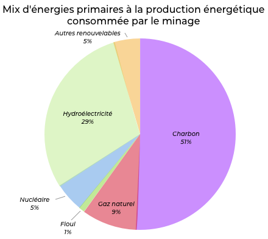

## Quid de ses impacts énergétiques ?
---

Selon un [rapport de l'Office parlementaire d’évaluation des choix scientifiques](../../sources/rapport_OPECST_blockchain.pdf), la consommation du Bitcoin est d’au moins 24 TWh/an, soit la production totale annuelle de 3 réacteurs nucléaires du Palier CP0 et CPY (soit les plus anciens en France) dont la production avoisine les 8 TWh. 

Celle des blockchains publiques (dont fait partie le Bitcoin) serait comprise 46,5 TWh/an et 200TWh/an selon les estimations.

En comparaison, la consommation énergétique annuelle de la France est de 530 TWh/an. La blockchain représenterait donc entre 8,68% et 37,74% des dépenses énergétiques Françaises si les fermes de minages étaient implantées sur le sol Français en exclusivité. Or, 60 % des fermes de minages sont situées en Chine dont la production énergétique provient majoritairement du charbon. Il y a là une problématique écologique majeure qui porte un préjudice considérable au développement de la technologie blockchain.

Par ailleurs, Bitcoin opère aujourd’hui environ 80 transactions par minute, quand Visa et Mastercard en exécutent respectivement près de 100 000. Ce coût énergétique est donc faramineux lorsqu'il est comparé à d'autres alternatives centralisées. Cette comparaison est d'autant plus choquante lorsque la majorité des ressources sont gaspillées durant le processus de vérification de blocs non-valides.

Ces chiffres sont à manipuler avec prudence car l'estimation de la consommation énergétique des blockchains n'est pas fiable, le matériel évoluant en permanence et les mineurs se gardant bien de communiquer sur leur consommation électrique.

En Islande, Genesis Mining indiquait en 2015 dans Business Insider, qu'elle constituait l’une des entreprises les plus énergivores de l'île, avec une dépense d’électricité de l’ordre de 60 dollars par bitcoin «extrait». Soit au cours actuel du bitcoin, une rémunération de 6243,99 dollars par bitcoin extrait.

Le mix énergétique de la production du Bitcoin révèle une utilisation massive des énergies fossiles. Mais également d'Hydroélectrique, renouvelable.

> Source: Energie Sia Partners
