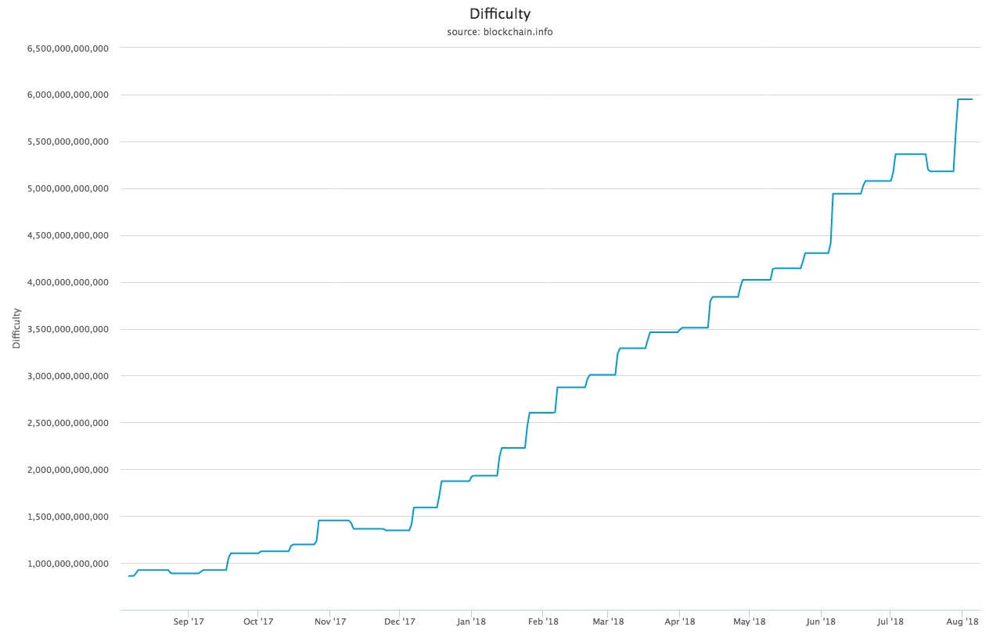
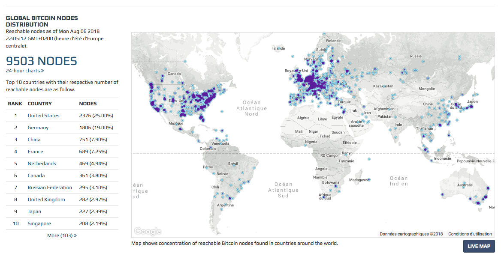

## Preuve de travail vs preuve de l'enjeu
---

Une blockchain est donc un registre distribué chiffré, et répliqué dans tous les nœuds du réseau, qui contient les chaînes d’ordres permettant, grâce à l’obtention d’un consensus, de gérer la confiance sans institution externe.

### Concernant la preuve de travail:

De l'anglais proof-of-work. Abrégé PoW.

Nous avons vu précédemment que la chaîne est constituée d'un ensemble de blocs de données contenant des informations ainsi qu'un horodatage. À chaque transaction, ces blocs sont intégrés à la chaîne.
 
Afin de garantir son intégrité, cette chaîne est chiffrée et doit être certifiée. 

Pour certifier la transaction, de puissants ordinateurs constitués de nœuds en réseau réalisent des calculs cryptographiques.

Le travail global de certification se nomme «preuve de travail» (proof of work). 

On appelle les machines (ou institutions) qui effectuent ce travail de certification des «mineurs» de l'anglais mining.

L'objet cryptographique crée par le mineur est la preuve du temps passé à la certification, il constitue la preuve de travail. 

Il est essentiel de garantir la nature réelle du travail des parties prenantes afin de préserver le consensus.

Fruit d'une invention d'Adam Back, inventeur du protocole Hashcash, elle évite un clonage facile qui aurait pour conséquences de pouvoir contrôler la blockchain de manière rétroactive.

Le mécanisme est même plus sophistiqué:à intervalles de temps réguliers, la difficulté augmente.

> Mesure relative de la difficulté de trouver un nouveau bloc. La difficulté est ajustée périodiquement en fonction de la puissance de hachage déployée par le réseau de mineurs.
>
> Source: blockchain.com 

La mise en concurrence est la méthode utilisée pour motiver à la certification, ainsi le premier mineur à valider un nouveau bloc sera récompensé.

Concernant le bitcoin, la tâche de certification était À l'origine accessible par les particuliers grâce à l'utilisation des cartes graphiques, dont la puissance pour le type de calcul nécessaire à la certification est supérieure.

Depuis des mineurs spécifiques sont apparus pour réaliser la preuve de travail et les cartes graphiques grand-public sont délaissés car non compétitive.

Car plus la taille des chaînes augmente, plus la puissance de calcul doit augmenter. Cette relation d'interdépendance a chassé les particuliers de la course à la certification et se sont désormais des institutions qui ont pris le relais.

> La ferme de calcul bitfarms
>
> Source: bitfarms.io

En août 2018, il y avait 9 503 nœuds de traitement de la blockchain bitcoin dans le monde.

> Global bitcoin nodes distribution
>
> Source: bitnodes.earn.com

Les services de mining sont disponibles dans le cloud à travers le cloud-mining, ce qui reste néanmoins un modèle plus orienté vers les entreprises ou les grandes organisations que les particuliers.

### Concernant la preuve de l’Enjeu:

De l'anglais proof-of-stake. Abrégé PoS.

Selon Usman W. Chohan, Proof-of-Stake Algorithmic Methods: A Comparative Summary

La preuve de l'enjeu est un algorithme différant de la preuve de travail permettant d'obtenir un consensus distribué.

Dans les crypto-monnaies basées sur les preuves d'enjeux, le créateur du bloc suivant est choisi par diverses combinaisons de sélection aléatoire et de richesse ou d'âge dépendant de l'enjeu économique d'un validateur dans le réseau. 

En preuve de travail (PoW), l'algorithme récompense les participants qui résolvent des puzzles cryptographiques afin de valider les transactions et de créer de nouveaux blocs (c.-à-d. l'exploitation minière).

Dans les chaînes de blocs publics basées sur les preuves d'enjeux (par exemple, l'implémentation prochaine de Casper d'Ethereum), un ensemble de validateurs se relaient pour proposer et voter sur le bloc suivant, et le poids du vote de chaque validateur dépend de la taille de son dépôt (c'est-à-dire de sa mise). 

Les avantages significatifs de la méthode par la preuve de l'enjeu comprennent la sécurité, la réduction des risques de centralisation et l'efficacité énergétique.

Il existe deux types d'algorithmes de preuve par l'enjeu: 

* Preuve en chaîne de l'enjeu: 

    Dans la preuve basée sur la chaîne, l'algorithme choisit un validateur au hasard pendant chaque tranche de temps (Ex: toutes les dix secondes), et assigne à ce validateur le droit de créer un bloc unique, et ce bloc doit pointer vers un bloc précédent (normalement le bloc se situant à la fin de la chaîne la plus longue). Ainsi on observe dans le temps une croissance en une chaîne unique.
    
* Preuve de l'enjeu de type BFT: 
    Dans la preuve de mise de type BFT, l'attribution se fait au hasard et le validateur se voit doté du droit de proposer des blocs. L'accord sur les blocs canoniques se fait à travers un consensus à plusieurs tours où chaque validateur vote pour un bloc spécifique. À la fin de ce processus, un accord est conclu entre tous les validateurs sur l'appartenance d'un bloc à la chaîne ou son rejet.

### Avantages de la preuve de l'enjeu par rapport à la preuve de travail: 

La preuve de l'enjeu apporte un avantage indéniable par rapport à la preuve de travail, la quantité d'électricité nécessaire pour sécuriser une chaîne de blocs est réduite.

Le coût du mécanisme de Bitcoin et d'Ethereum est estimé à plus d'un millions de dollars en électricité et en matériel informatique par jour. Le sujet est donc crucial pour le développement futur de la blockchain.

Voir [Quid de ses impacts énergétiques](./impact_energetique.md)

Une plus faible consommation en matière première implique un besoin moindre de motivation, et donc un coût par transaction plus faible et une meilleure participation du réseau.

Cela ouvre la porte à une meilleure régulation des dérives qui peuvent toucher la blockchain comme le phénomène du mineur égoïste ou les activités des cartels qui tentent de centraliser la blockchain.

L'introduction de la preuve de l'enjeu introduit une réduction des risques de centralisation, car les économies d'échelle sont beaucoup moins incitées et permettent à de petits acteurs de subsister. 

Augmentation du coût d'une attaque par 51% de manière spectaculaire par rapport à la méthode de la preuve de travail: 
 
> «C'est comme si votre ferme ASIC brûlait si vous participiez à une attaque de 51%».
>
> Vlad Zamfir, Ethereum Foundation researcher 

### Infographie comparative des deux méthodes: 

