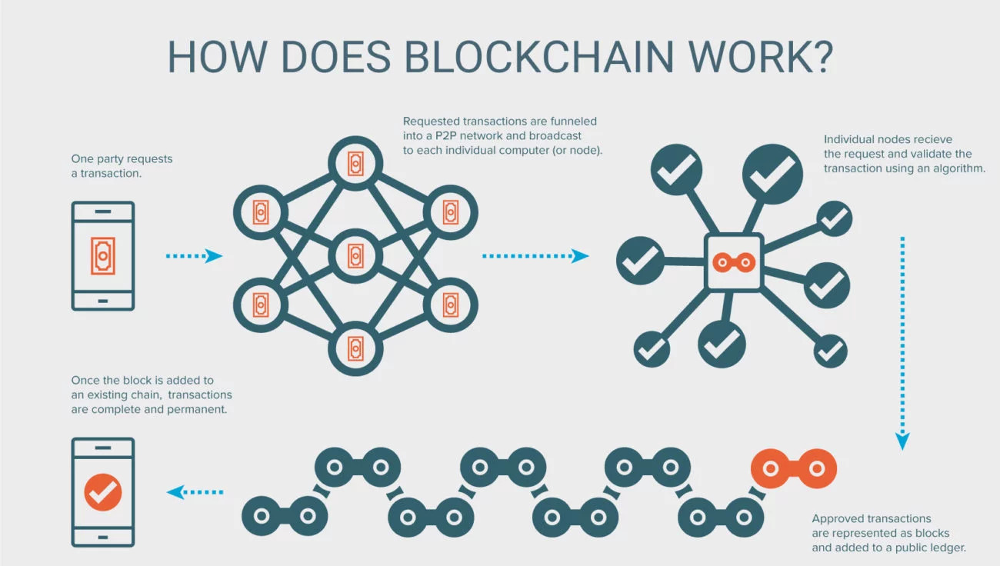

# Définition : blockchain
---

Une (ou un) blockchain, ou chaîne de blocs est 
une technologie de stockage et de transmission d'informations sans organe de contrôle.

Techniquement, il s'agit d'une base de données distribuée
dont les informations envoyées par les utilisateurs et les liens internes à la base 
sont vérifiés et groupés à intervalles de temps réguliers en blocs, 
l'ensemble étant sécurisé par cryptographie, 
et formant ainsi une chaîne. 

Par extension, une chaîne de blocs est 
une base de données distribuée qui gère une liste d'enregistrements protégés contre la 
falsification ou la modification par les nœuds de stockage.

---

Une blockchain est donc un 
registre distribué et sécurisé de toutes les transactions effectuées depuis le démarrage 
du système réparti.

Il existe des blockchains publiques, ouvertes à tous, et des blockchains privées, 
dont l’accès et l’utilisation sont limitées à un certain nombre d’acteurs.

Une blockchain publique peut donc être assimilée à un grand livre comptable public, 
anonyme et infalsifiable. 

> il faut s’imaginer « un très grand cahier, 
> que tout le monde peut lire librement et gratuitement, sur lequel tout le monde peut écrire, 
> mais qui est impossible à effacer et indestructible. »

> Jean-Paul Delahaye, Les blockchains, clefs d’un nouveau monde

