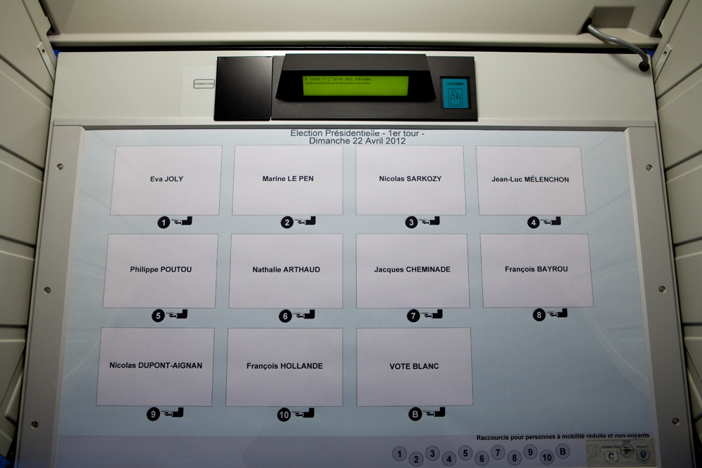

# Définition: vote
---

Le vote (du latin _*votum*_ signifiant «vœu») désigne une méthode permettant à un groupe une prise de décision commune. 

Les organisations formelles ou informelles, de toute nature (économiques, politiques, associatives, etc.), ont recours à cette pratique. La pratique du vote vise à donner une légitimité à la décision en montrant qu'elle ne vient pas d'un individu isolé. Avant que le vote proprement dit n'ait lieu, il est fréquent qu'un temps de discussion ou de débat soit ménagé pour permettre à chacun des votants d'exposer ou de prendre connaissance des arguments, afin de motiver au mieux sa décision.

Le vote est généralement encadré par un processus électoral aussi dénommé «scrutin» ou «élection».

---

## Les enjeux du vote: 

| Principe | Explication |
|------------------------|----------------------------------------------------------------------------------------------------------------------------------------------------------------------------------------------------------------------------------------------------------------------------------------------------------------------------------------------------------------|
| Décidabilité | Le but premier est généralement de pouvoir décider d'une position, qu'il s'agisse d'une position consistant à prendre une décision, ou d'une position consistant à ne pas prendre de décision; c'est notamment le cas d'un référendum. |
| Unicité du vote | Généralement on souhaite l'unicité du vote: pour permettre à chacun d'être justement représenté, il ne faut pas permettre à un électeur de voter plusieurs fois, c'est-à-dire d'être sur représenté. |
| Représentativité | Certains systèmes de propriété (propriété au sens légal) conduisent à ce que les voix de chaque électeur soient pondérées par une quote-part de participation. |
| Secret et transparence | Suivant le scrutin, on peut souhaiter que le vote soit secret, afin de prévenir la corruption du vote, ou bien au contraire public, afin de contraindre à un positionnement assumé. |
| Vérifiabilité | Afin de lever tout doute sur la légitimité du scrutin, lorsqu'un enjeu existe, on souhaite que le scrutin soit vérifiable, c'est-à-dire que l'on puisse démontrer aux yeux de tous l'absence de triche. On souhaite alors s'assurer que les personnes et matériels impliqués dans l'organisation ne soient pas détournés aux profits d'intérêts spécifiques. |
| Attractivité | Certaines organisations commerciales promeuvent des votes dans le but inavoué de susciter la participation à une action qui sans le dire est un acte d'achat. C'est notamment le cas des votes visant à l'achat par «numéros de services à valeur ajoutée» également connues sous l’appellation de communication téléphonique surtaxée. |
| Non-participation | Pour éviter qu'une décision ne soit prise par défaut ou pour pallier certains aléas, il est de coutume de permettre la non-participation, par exemple au travers de l'abstention, ou du vote nul ou blanc. |
| Quorum et majorité | Pour donner une légitimité accrue à la prise de décision, la méthode de vote peut être corrélée à un système de quorum et/ou de majorité qualifiée. |
| Rapidité | Dans un vote où l'on attend un résultat positif, il est d'usage de demander d'abord qui est contre et ensuite qui s'abstient. Les personnes qui ne se prononcent pas sont alors supposées en faveur de la décision. Ceci présente une double avantage: cela évite de devoir compter les nombreux pour, tout en maximisant leur nombre. |

---

## Modes d'expression: 

* Vote à bulletin secret: Le vote à bulletin secret, aussi appelé scrutin secret, consiste à donner son avis sur plusieurs propositions, de manière anonyme. 

* Vote à main levée: 
Le vote à main levée consiste à lever sa main pour donner son avis entre plusieurs propositions. Il permet une prise de décision rapide, car le dépouillement est quasi immédiat. Mais cela oblige à ce que tous les votants soient présents en même temps. La procédure peut commencer par le vote par acclamation, où on estime le volume sonore de chaque option comme à l'assemblée spartiate ou lors de la conclusion de primaires présidentielles aux États-Unis.

>
> Vote à main levée, source Assemblée Nationale Française

* Vote public:
Le vote public, aussi appelé vote à l'appel nominal, consiste à appeler tour à tour chacun des membres d'une assemblée à exprimer son vote publiquement. Celui-ci est alors consigné dans le registre des délibérations et il est ensuite possible de publier le vote de chacun des participants au scrutin.

* Vote par correspondance:
il consiste à envoyer à l’avance son bulletin de vote par voie postale ; un numéro d’identification permet de garantir qu’une personne ne vote qu’une fois, tout en maintenant le secret du vote.

* Vote par procuration: Le vote par procuration permet au mandant de désigner un mandataire qui ira voter à sa place. 

* Vote de remplacement:
Le vote de remplacement permet à ceux qui votent pour des candidats ou des listes n’ayant pas d’élus faute d’avoir atteint le quorum de prévoir le report de leur voix sur un autre candidat.

* Vote électronique:
Le vote électronique est un système de vote automatisé, notamment des 
scrutins, à l'aide de systèmes informatiques. Ce terme générique relève en vérité de plusieurs situations concrètes. Par exemple, il peut correspondre à l'informatisation du processus de vote permettant de voter à distance, c’est-à-dire de voter de chez soi, ou de n'importe où dans le monde et ainsi éviter de se déplacer dans des bureaux de vote.

    
    >
    > Une machine à voter électronique Française, source Mairie de Saint-Pol-sur-Mer.

* Vote par clé: 
Il consiste à voter à l'aide d'une clé physique sur un pupitre dédié.

---

## Le cas particulier du vote par Internet n'en est pas un.
Le vote par internet, qui s'inscrit dans le mode d'action du vote électronique à longtemps été décrié au motif que son principal inconvénient serait l'absence d'isoloir (rien ne garantirait que le citoyen soit seul devant l'ordinateur au moment où il vote, ni ne permet de le vérifier). Néanmoins cette assurance est également absente lors du vote public, par correspondance, à main levée. Il est également impossible de s'assurer que la volonté du mandant ait bien été respectée dans le cadre d'un vote par procuration.
