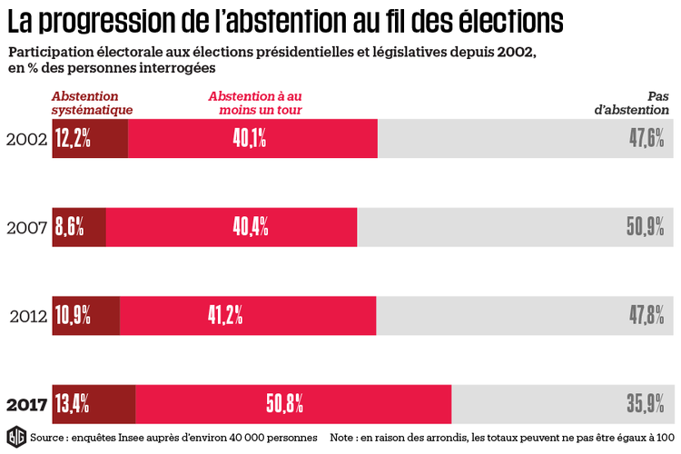

## Les domaines d'enjeux
---

La sphère publique, au sens arrendtiens, est agitée des nombreuses problématiques que nous avons illustrée précédemment. Dans cette dimension publique, le vote est la forme d'expression reine, elle permet la consultation du plus grand nombre. 

Le vote dans la sphère publique invite à s'interroger sur la représentativité en matière de prise de décision, de diponibilité physique des votants, de la transparence du processus démocratique, de l'intégrité et de la traçabilité. 

De nombreuses implémentations du vote sont connexe au sein des institutions publiques, des associations, des entreprises dont la gestion se veut collaborative, par conséquent, les réponses apportées à ces besoins peuvent ètre proches, voir similaire.

Par exemple la participation aux éléections nationales en France voit sa participation chuter d'année en année : 

>
> L'abstention en France depuis 2002, source INSEE

La blockchain, parce qu'elle supprime en partie le besoin de confiance, pourrait rassurer le grand public dans son acte de participation et pourrait constituer un moteur de ré-engagement de ce dernier.

### Les différentes formes de vote dans la sphère publique : 

#### Le vote dans les conseils d'administration :

Ils ont pour champ de compétence l'administration des institutions, associations, entreprises ou un établissements public.

L’organisation, le fonctionnement et les prérogatives du conseil d’administration sont fixés par le statut de l'institution et dépendent du droit national. (Art. L.225-36-1 C. com.).

En général les statuts prévoient la périodicité des réunions et les modalités de convocations des administrateurs. 

Un conseil d'administration doit théoriquement se tenir dès lors que la situtation de l'entreprise l'exige. Or, la tenue de celui ci est de facto conditionné à la disponibilité physique des parties prenantes.  

Les décisions sont pris par le vote au sein d'un conseil d'administration, en général à main levée. Ce qui implique la confiance dans le déroulé honnête de celui-ci, la traçabilité n'étant assuré que par le tiers de confiance qui le rapporte. Ce vote à main levée pose également la question de la confidentialité, comment s'assurer que des pressions n'ont pas eu lieu au préalable? Un vote à bulletin secret permettrait de s'affranchir d'une telle question.

* La participation de la personne morale au conseil d'administration :
    Si une personne morale est membre d'un conseil d'administration, elle désigne une personne physique pour la représenter. De la délégation de ce vote découle un doute : le délégataire est dans la capacité de dépasser ou d'outrepasser les choix préalable du ou des délégants.

* L'intégration du salarié : 
    Le projet de loi sur la croissance des entreprises, dit loi Pacte, prévoit de renforcer la présence des représentants salariés dans les conseils d'administration (Projet de loi PACTE article 62, alinéa II). 
    
   Ce projet de loi introduit une plus grand participation de salarié comme vecteur de croissance économique selon le Rapport d'étude d'impact du projet de loi relatif à la croissance et la transformation des entreprises.
    
#### Le vote dans la consultation publique

* Dans le cadre de la pétition :

* Dans le cadre de l'administration du bien public : 

L'administration du bien public en toute transparence est une préoccupation majeure de ces dernières années. Elle se pose à deux niveau, le premier concerne la prise de décision  et  implique la concertation publique. La seconde implique la gestion continue du bien et sa gouvernance. Les biens public sont mutliples et les propositions les concernant peuvent provenir des citoyens mais également des institutions.

#### Le vote dans la gestion collaborative :

* La co-gestion avec les utilisateurs : 
    Le crowdfunding désigne tous les outils et méthodes de transactions financières qui font appel à   un grand nombre de personnes afin de financer un projet. Les manifestations de soutiens provenant des utilisateurs de ces outils sont de deux types : La première, un soutien financier consiste en une transaction dont le montant représente un pourcentage d'un objectif, et une seconde l'acte de transaction qui représente un soutient en tant que tel. Le montant de la transaction ne représentant qu'une échelle du soutien. Enregistrer ces informations dans une blockchain permettrait à la fois de supprimer la nécessité de recourir à la confiance et de recourir à des smart contracts afin de garantir la bonne execution de l'acte soutenu. 

* Du besoin spécifique des associations :

    Les associations peuvent recourir à la consultation du public par le vote dans plusieurs cas : 
    * Choix des projets associatifs
    * Allocations des budgets
    * Désignation des administrateurs
    * déterminsation des processus opérationnels
    
    L'action des associations est soumis à la confiance de ses donateurs, de nombreux scandales ont illustré que cette confiance était parfois abusée.

### Les promesses de la Blockchain : 

Le recours a la Blockchain dans ces méthodes de prises de décisions par le vote permettrait :
* Une plus grande représentativité par l'intégration d'un grand nombre d'acteurs. ( dans les limites d'échelle permise. )
* Une indépendance quant à la diponibilité physique des votants. Particulièrement avantageuse dans le cadre d'organisations internationales ou éclatées.
* Intégrité de la décision, par des processus de lutte contre la falsification.
* Traçabilité de la donnée.
* Transparence des décisions et des processus.

### En synthèse

| Acteur | Conseil d'administation | Management Participatif |  Consultation publique | Election des administrateurs et représentants | 
|:------:|:------------------------:|:-----------------------:|:----------------------:|:--------------------------------------------:|
| Institution |  |  |  |  |
| Association |  |  |  |  | 
| Entreprise |  |  |  |  | 
| Etablissements public |  |  |  |  | 
| Grand public |  |  |  |  | 
