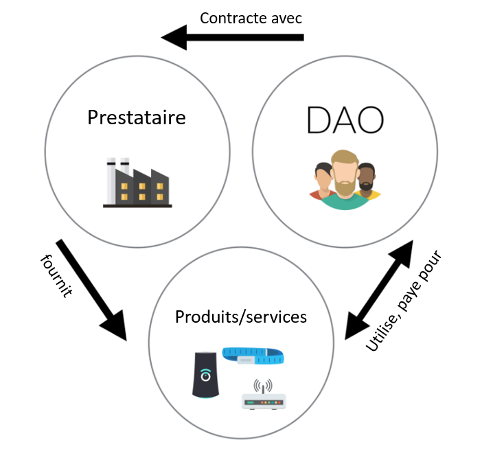

## Gouvernance des entreprises
---

La blockchain propose un modèle de gouvernance des entreprises avec preuves, traçabilitée et transparence.

### DAO
Une DAO (Decentralized Autonomous Organization) est une organisation décentralisée.
 Les règles la régissant sont inscrites dans une blockchain.

Cela rejoint le principe de loi par le code (law by code). 

L'intéret de cette méthode est de disposer d'une preuve immuable.

> C’est une forme d’organisation incorruptible qui appartient aux personnes qui ont aidé à la créer et à la financer, et dont les règles sont publiques. Il n’y a donc pas besoin de faire confiance à qui que ce soit, car tout est dans le code, auditable par chacun.
>
>Stephan Tual, TheDAO

Les DAOs utilisent la technologie des smart contracts ( voir smart-contract )pour fonctionner.

Quels sont les éléments apportés par une DAO?

Selon Simon de la Rouviere, blockchain Consensys : il existe trois élèments fondamentaux apportés par une DAO. 
Le premier est que la DAO est instoppable, elle ne peut ni ètre fermée ni arretée. 
La seconde est que l'entitée est forcée de fairez acte de transparence et l'intégrité de ses données sont préservées, ainsi un individu ne peut prétendre à la manipuler ou la controler.
La dernière est non pas des moindres est le caractère auditable à l'échelle supranationale, en effet lors du contrôle d'une entitée, les auditeurs s'appuient soit sur des organes de contrôles du pays de résidence, soit des auditeurs indépendants. Parfois il est imlpossible d'effectuer ces contrôles librement ou sans crainte d'une fraude. 

La DAO apparait comme une organisation ouverte, globale, indépendante de toute juridiction et protégée d'une partie des fraudes qui agitent les organisations classiques grâce à l'application de la Loi par le code .

[//]: # (TODO: CLEAN) 

### TheDAO

Le projet « TheDAO », créé en 2016 à l’initiative de l’équipe de la start-up blockchain Slock.it, constitue l’exemple plus célèbre à ce jour d’un tel type d’organisation. « Le but de « TheDAO » est d’être une expérience avant tout. C’est un type d’organisation atypique qui n’est pas adapté à toutes les situations, mais qui est une application concrète de la situation de « trustlessness », cet environnement où la confiance n’est pas nécessaire, créée par la blockchain » expliquait à sa création Stephan Tual. TheDAO fonctionnait avec la blockchain Ethereum.

La fonction du projet TheDAO était triple : évaluer des projets qui lui sont soumis ; décider collectivement avec les détenteurs de jetons de la DAO de financer ou non ces projets ; distribuer les risques et récompenses qui y sont relatifs.

TheDAO était constituée d’une part des détenteurs de jetons qui constituent les « actionnaires » de la DAO, et d’autre part des prestataires. Les premiers participaient à la création de la DAO, investissent de l’argent en échange de jetons, et constituaient la base de la DAO. Les seconds étaient ceux qui devaient ensuite soumettre des projets à la DAO et demander du financement.

TheDAO se plaçait à la croisée du crowdfunding, du fond d’investissement et de la fondation.

[//]: # (TODO: REDO SCHEMA)

Lors de sa « crowdsale », TheDAO était devenu en 2016 la plus grande campagne de crowdfunding de tous les temps, en dépassant les 160 millions de dollars levés en près de quatre semaines. Mais le 17 juin 2016, The DAO a été victime d’une attaque de grande ampleur (un hacker a profité d’une faille dans le code) qui a conduit à l’arrêt de son développement. The DAO a donc été une (courte) expérimentation ayant mis en lumière les défis qui restent à résoudre pour que ce type d’organisation puisse prospérer (pour aller plus loin : une tribune de la chercheuse Primavera de Filippi sur les leçons de l’affaire TheDAO).

On peut imaginer aisément que disposer d'une blockchain pour enregistrer les actions de son entreprise deviendra aussi indispensable qu'un expert comptable pour les marchés financiers.
