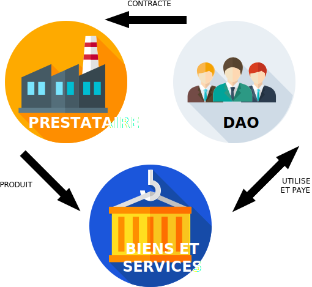

## Gouvernance des entreprises
---

La blockchain propose un modèle de gouvernance des entreprises avec preuves, traçabilitée et transparence.

### DAO
Une DAO (Decentralized Autonomous Organization) est une organisation décentralisée.
 Les règles la régissant sont inscrites dans une blockchain.

Cela rejoint le principe de loi par le code (law by code). 

L'intéret de cette méthode est de disposer d'une preuve immuable.

> C’est une forme d’organisation incorruptible qui appartient aux personnes qui ont aidé à la créer et à la financer, et dont les règles sont publiques. Il n’y a donc pas besoin de faire confiance à qui que ce soit, car tout est dans le code, auditable par chacun.
>
> Stephan Tual, TheDAO

Les DAOs utilisent la technologie des smart contracts ( voir smart-contract )pour fonctionner.

#### Quels sont les éléments apportés par une DAO?

Selon Simon de la Rouviere, blockchain Consensys : il existe trois élèments fondamentaux apportés par une DAO. 
Le premier est que la DAO est instoppable, elle ne peut ni ètre fermée ni arretée. 
La seconde est que l'entitée est forcée de faire acte de transparence et l'intégrité de ses données sont préservées, ainsi un individu ne peut prétendre à la manipuler ou la controler.
La dernière est non pas des moindres est le caractère auditable à l'échelle supranationale, en effet lors du contrôle d'une entitée, les auditeurs s'appuient soit sur des organes de contrôles du pays de résidence, soit des auditeurs indépendants. Parfois il est imlpossible d'effectuer ces contrôles librement ou sans crainte d'une fraude. 

La DAO apparait comme une organisation ouverte, globale, indépendante de toute juridiction et protégée d'une partie des fraudes qui agitent les organisations classiques grâce à l'application de la Loi par le code.

#### TheDAO

Le project TheDAO est à l'initiative de la start-up slock.it et est l'exmple le plus remarquable de ce genre d'organisation. C'est avant tout un POC. 

Le type d'organisation DAO n'est pas adapté à la totalité des situations, mais elle répond concrètement à une situation où la confiance n'est pas nécessaire puisque le fonctionnement de l'organisation est garanti. TheDAO s'appuit pour fonctionner sur la blockchain Ethereum.
 
Les trois actions possibles à l'intérieur de TheDAO était premièrement l'évaluations des projects, deuxièmement la décision collective et troisièmement la distirbution des risques et rémunérations relatives.

Ce projet se situait à la frontière du crowdfunding, de la fondation et du fond d'investissement.

> Un schéma d'illustration d'une DAO

##### TheDao et le vote

Afin de participer au vote sur la plateforme TheDAO, il fallait au préalable avoir l'acquisition de jetons (tokens) et en faire l'échange contre un vote.

Il s'agit donc d'une transaction conventionnelle.

Le votant se verra alors retribué si sa proposition est financée. 

##### Fin du projet

En juin 2016, TheDAO a vu son développement arrêté suite à une attaque de grande ampleur.
 cela n'a donc été qu'une courte expérimentation qui a permis la mise en lumière des axes d'améliorations pour le développement de ce type d'organisation.

On peut imaginer aisément que disposer d'une blockchain pour enregistrer les actions de son entreprise deviendra aussi indispensable qu'un expert comptable pour les marchés financiers.

Afin de remettre en perspective cet échec et d'illustrer l'engouement du public pour la technologie blockchain il est de bon ton de rappeller que lors de sa crowdsale, la mise en vente publique de token, TheDAO était la plus grosse campagne de crowdfunding de tous les temps avec une levée de plus de 160 millions de dollars en seulement un mois.
